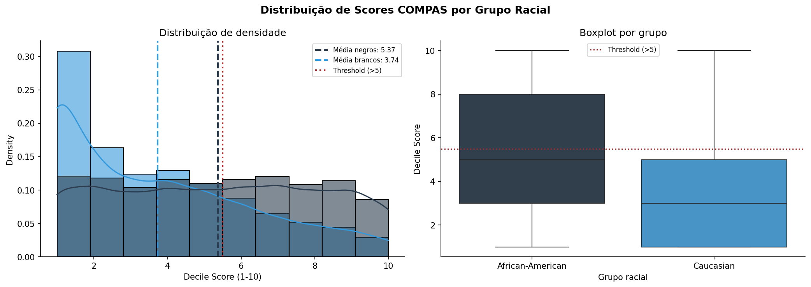
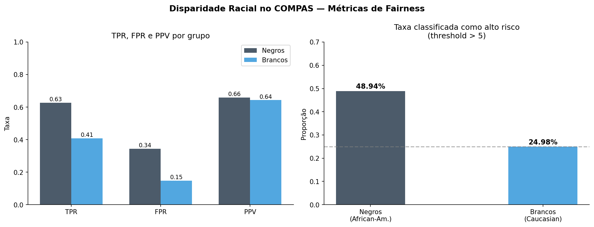

# ⚖️ Análise de Fairness no Sistema COMPAS


## 📌 Introdução

Este projeto investiga a presença de **viés racial no algoritmo COMPAS** (Correctional Offender Management Profiling for Alternative Sanctions), utilizado em tribunais norte-americanos para prever riscos de reincidência criminal.

Baseado no dataset público do ProPublica e na investigação *Machine Bias* (Angwin et al., 2016), a análise combina testes estatísticos formais, métricas de fairness algorítmica e visualizações para quantificar disparidades raciais nas predições do modelo.

## 🔑 Resultados principais

| Métrica | Negros | Brancos | Disparidade |
|---|---|---|---|
| Score médio | 5.37 | 3.74 | +43% |
| Classificado como alto risco | 48.9% | 25.0% | 1.96x |
| FPR (falsos positivos) | 45% | 23% | 1.96x |
| TPR (verdadeiros positivos) | 72% | 52% | +20pp |
| Cohen's d | — | — | 0.60 (efeito médio-grande) |
| Paridade Demográfica | — | — | ✗ Viola 80% rule |
| Equalized Odds | — | — | ✗ Viola TPR e FPR |

## 📊 Visualizações

| Distribuição de Scores | Métricas de Fairness |
|---|---|
|  |  |

## 🧠 Metodologia

Etapa 1 → Carregamento e pré-processamento (ProPublica GitHub)

Etapa 2 → EDA — distribuição de scores por grupo racial

Etapa 3 → Pressupostos: Shapiro-Wilk + Levene

Etapa 4 → Welch t-test + Cohen's d

Etapa 5 → Análise de viés: taxa de alto risco + Paridade Demográfica

Etapa 6 → Qui-Quadrado para FPR

Etapa 7 → Métricas de fairness: TPR, FPR, PPV — Equalized Odds

Etapa 8 → Visualização consolidada das disparidades

**Threshold adotado:** `decile_score > 5` = alto risco (padrão ProPublica).
Critério mantido consistentemente em toda a análise.

## 🔍 Principais achados

**1. Viés sistêmico confirmado estatisticamente:**
- Diferença de médias: t = 23.29, p ≈ 0 — rejeita H₀
- Efeito médio-grande: Cohen's d = 0.60
- FPR para negros é quase o dobro da FPR para brancos

**2. Violações de fairness:**
- ✗ Paridade Demográfica (razão = 0.51 < 0.80)
- ✗ Equalized Odds (TPR +20pp, FPR +22pp entre grupos)

**3. Impacto social:**
- Não reincidentes negros são erroneamente classificados como alto risco em proporção muito maior — podendo resultar em sentenças mais severas
- O sistema perpetua desigualdades sistêmicas preexistentes

**4. Recomendações:**
- Revisão crítica do uso de algoritmos preditivos em decisões judiciais
- Implementação de auditorias contínuas de fairness
- Adoção de métricas de Equalized Odds como critério mínimo de aprovação

## 🛠️ Stack

- **Análise estatística:** SciPy, NumPy, pandas
- **Visualização:** matplotlib, seaborn
- **Ambiente:** Google Colab / Jupyter

## ▶️ Como executar

```bash
pip install pandas numpy scipy matplotlib seaborn
```

Execute o notebook: `notebooks/COMPAS_Fairness_v2.ipynb`

O dataset é carregado automaticamente via URL pública do ProPublica — sem necessidade de download manual.

## 📚 Referências

- Angwin, J. et al. (2016). *Machine Bias*. ProPublica.
- Chouldechova, A. (2017). *Fair prediction with disparate impact*. Big Data Journal.
- Kleinberg, J. et al. (2016). *Human decisions and machine predictions*. NBER.
- Bruce, P. & Bruce, A. (2019). *Estatística Prática para Cientistas de Dados*.

## 🔗 Projeto relacionado

Para abordagem bayesiana de A/B testing:
[Inferência Bayesiana Aplicada — bayesian-ab-marketing](https://github.com/gilsonmm6/bayesian-ab-marketing)

## 👤 Autor

**Gilson Machado Monteiro**
Data Analyst & BI Analyst | Especialização em Estatística Aplicada (PUC Minas)
[LinkedIn](https://linkedin.com/in/gilsonmm6) · [GitHub](https://github.com/gilsonmm6)
